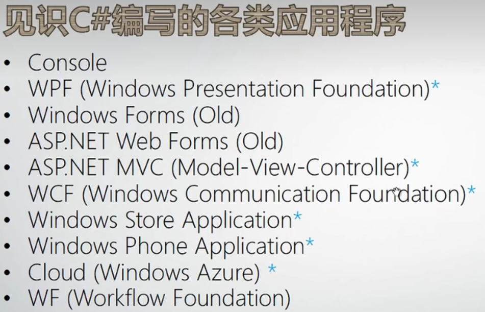
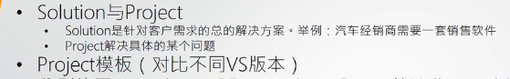

# C#能编写的常用程序

# VS文件管理

>VS以解决方案即solution做最顶层，里面包含对各project  
VS的默认项目是运行第一个，需要在解决方案的属性中进行更改  
VS可以在选项中设置字体背景等主题

# Windows Form WPF 适合桌面开发
> * 拖拽控件进行布局
> * 更改控件name，文字使其更加语义化
> * 添加事件，控件属性栏的闪电标识

# ASP.NET Web端，
> * 公司内使用，需要好好研究